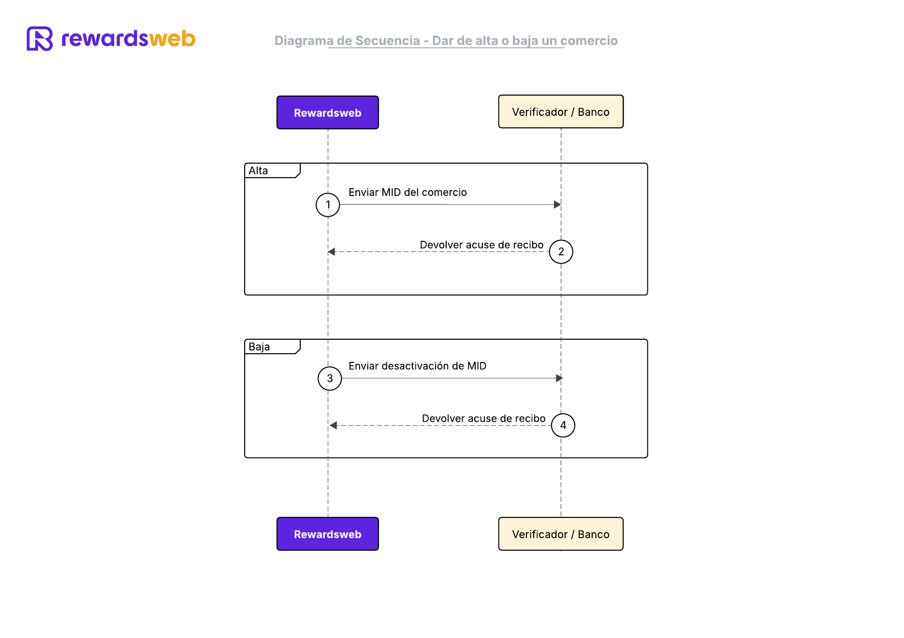

# Paso 1 – Dar de alta o baja un comercio

### 📋 Descripción
Rewardsweb notificará a un endpoint sobre los comercios participantes y los programas que desean aceptar.

---

### 🖼️ Diagrama de Secuencia


---

### 🔗 Endpoints propuestos
- `POST /api/v1/mids`
- `PUT /api/v1/mids/{mid}`
- `DELETE /api/v1/mids/{mid}`

---

### 🧩 Ejemplo de request
```
curl -X POST https://verifier.com/api/v1/mids \
-H "Content-Type: application/json" \
-H "Authorization: Bearer <token>" \
-d '{
    "mid": "MID987654321",
    "program_id": "LIFEMILES"
}'
```