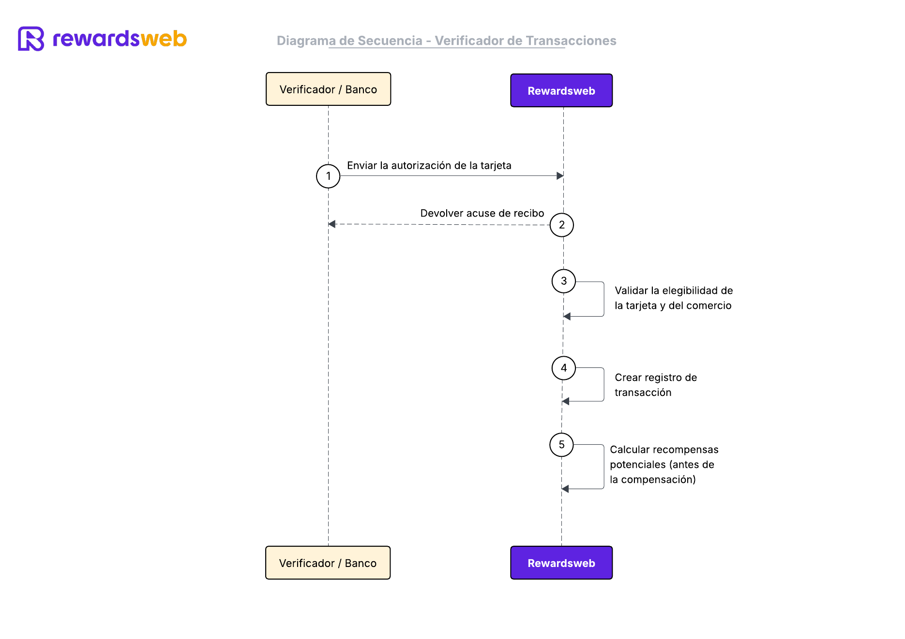

# Paso 3 - Verificación de Transacciones

### 📋 Descripción
Cuando un PAN realiza una transacción en un MID registrado, el verificador deberá enviar una copia de la transacción a Rewardsweb.

---
### 🖼️ Diagrama de Secuencia


---

### 🔗 Endpoints propuestos
- `POST /api/v1/transactions`

---

### 🧩 Ejemplo de request
```
curl -X POST https://api.rewardsweb.com/v1/transactions \
  -H "Authorization: Bearer YOUR_TOKEN" \
  -H "Content-Type: application/json" \
  -d '{
    "transaction_id": "abc123456789",
    "mid": "MID987654321",
    "card_id": "CARDID1",
    "amount": 150.75,
    "currency": "GTQ",
    "timestamp": "2025-07-29T14:30:00Z",
    "auth_code": "A1B2C3",
    "mcc": "5814",
    "merchant_name": "Pollo Campero",
  }'
```