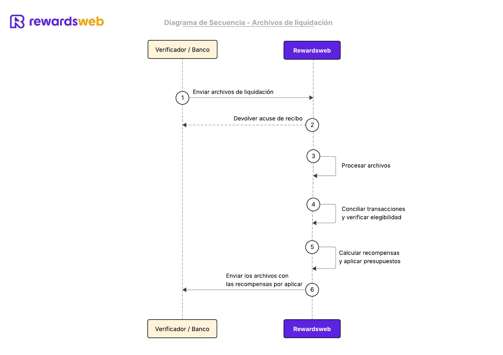

# Paso 4 - Archivos de liquidación

### 📋 Descripción
El verificador transferirá a Rewardsweb un archivo de liquidación, utilizando SFTP o una carga de archivo vía HTTPS.

---
### 🖼️ Diagrama de Secuencia


---

### 🔗 Endpoints / Métodos propuestos
- `POST /settlements/upload` (para carga de archivo)
- SFTP (conexión segura con credenciales dedicadas)

---

### 🧩 Ejemplo de conexión
```
sftp -i ~/.ssh/verifier_key svc-verifier@sftp.rewardsweb.com << 'EOF'
cd /incoming/settlements
put settlements_20250809_001.csv
bye
EOF
```

---

### 📂 Ejemplo de archivo (CSV)
```
trans_id,card_id,mid,amount,currency_code,purchase_date
T123456789,1234567890,M12345,350000,GTQ,2025-08-29T12:30:00Z
T987654321,9876543210,M67890,500000,GTQ,2025-08-29T13:00:00Z
```